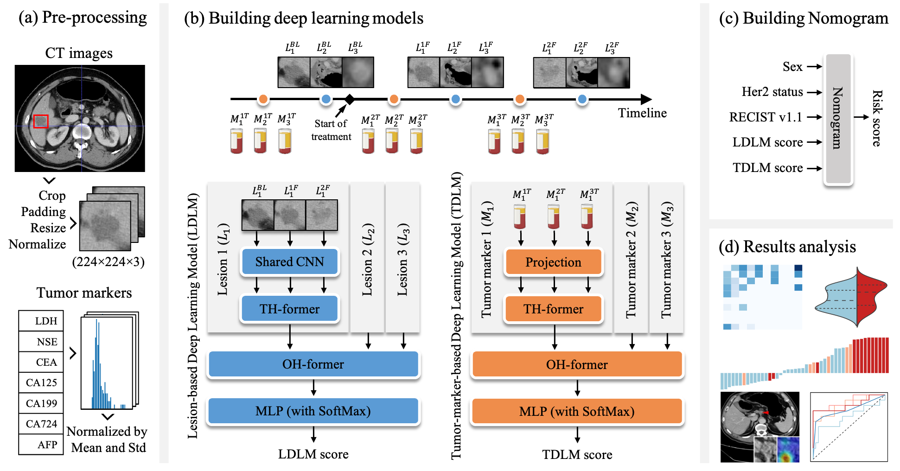

# A deep learning model for predicting benefit from anti-HER2 targeted therapy in metastatic gastric cancer using multifocal and time-series CT images

## Introduction
This repository is the official PyTorch implementation of A deep learning model for predicting benefit from anti-HER2 targeted therapy in metastatic gastric cancer using multifocal and time-series CT images. 

### Objectives
Due to the unique spatiotemporal heterogeneity of metastatic gastric cancer (mGC), the existing size-based criteria are difficult to predict the benefit of anti-HER2 targeted therapy. This study aimed to propose a novel criterion based on deep learning that integrated such heterogeneity to enhance the accuracy of predicting prognosis and response in patients with mGC receiving anti-HER2 targeted therapy.
 
### Methods
This multi-central study enrolled from one center 137 patients for retrospectively internal training/validation and 33 patients for prospective evaluation and recruited 37 patients from another three centers for external validation. All patients received anti-HER2-targeted therapy, underwent pre- and post-treatment CT scans (baseline and at least one follow-up), and only the patients from the first center were collected with tumor markers. The proposed deep learning model evaluated the lesions in time-series CTs or tumor markers to predict risk probabilities. Furthermore, we built a Nomogram to aggregate the risk probabilities and clinical information to compute the treatment risk.

### Results
Experimental results showed that our model achieved AUC scores of 0.894 (0.768-1.019) and 0.809 (0.561-1.056) in the internal validation and prospective cohort. The AUC score in the external validation cohort was 0.771 (0.510-1.031) using only time-series CTs. The results also showed that patients with low-risk scores derived survival benefits from anti-HER2 targeted therapy significantly more than those with high-risk scores (all P<0.05).

### Conclusions
The proposed method has the potential to effectively read the probability of the future benefit in patients with HER-2-positive mGC and reveal clinical patterns across lesions and time series.



## Requirements
- Pytorch>=1.1.0
- CPU or GPU
- Other packages can be installed with the following command:
```
pip install requirements.txt
```

## Quick start
Runing the following command to train and evaluate the model:
```
python train.sh
```

## Results
We have constructed several models:

| Models | CT(BS) | CT(1F) | CT(2F) | Tumor markers | RECIST | Clinical info. | Descriptions |
|---|---|---|---|---|---|---|---|
| RECIST v1.1 | ✓ | ✓ | ✓ | | | | Based on RECIST v1.1，treatment response is defined as PR, SD and PD |
| TB-Δ | ✓ | ✓ | ✓ | | | | change of percentage in tumor size |
| LDLM-BS | ✓ | | | | | | LDLM based on baseline CT scans |
| LDLM-1F | ✓ | ✓ | | | | | LDLM based on baseline and the first one follow-up CT scans |
| LDLM-2F | ✓ | ✓ | ✓ | | | | LDLM based on baseline and the first two follow-up CT scans |
| TDLM | | | | ✓ | | | Based on serial tumor markers |
| Nomo-wot | ✓ | ✓ | ✓ | | ✓ | ✓ | Nomogram integrated by LDLM, RECIST, and clinical information |
| Nomo-all | ✓ | ✓ | ✓ | ✓ | ✓ | ✓ | Nomogram integrated by LDLM, TDLM, RECIST, and clinical information |

Performance comparisions of differnet models on the training cohort (n=91):

| Models | C-index (95% CI) | HR (95% CI) | HR (P value) | AUC (95% CI) |
|---|---|---|---|---|
| RECIST v1.1 | 0.648 (0.577-0.719) | 1.858 (1.363-2.534) | <0.0001 | 0.753 (0.636-0.869) |
| TB-Δ | 0.613 (0.527-0.698) | 1.006 (1.000-1.013) | 0.0447 | 0.675 (0.545-0.804) |
| LDLM-BS | 0.661 (0.594-0.728) | 4.715 (1.939-11.466) | 0.0006 | 0.744 (0.620-0.868) |
| LDLM-1F | 0.721 (0.655-0.787) | 5.573 (2.834-10.958) | <0.0001 | 0.771 (0.661-0.880) |
| LDLM-2F | 0.775 (0.717-0.833) | 25.409 (9.676-66.725) | <0.0001 | 0.879 (0.792-0.966) |
| TDLM | 0.717 (0.641-0.792) | 9.230 (3.825-22.274) | <0.0001 | 0.780 (0.666-0.894) |
| Nomo-wot | 0.795 (0.740-0.851) | 73.613 (24.399-222.092) | <0.0001 | 0.903 (0.819-0.987) |
| Nomo-all | 0.807 (0.748-0.866) | 115.751 (34.611-387.108) | <0.0001 | 0.891 (0.808-0.975) |

Performance comparisions of differnet models on the internal validation cohort (n=46):

| Models | C-index (95% CI) | HR (95% CI) | HR (P value) | AUC (95% CI) |
|---|---|---|---|---|
| RECIST v1.1 | 0.652 (0.525-0.780) | 1.583 (1.100-2.277) | 0.0133 | 0.759 (0.580-0.938) |
| TB-Δ | 0.594 (0.471-0.718) | 1.011 (1.000-1.022) | 0.0456 | 0.651 (0.437-0.866) |
| LDLM-BS | 0.632 (0.501-0.762) | 3.225 (0.993-10.473) | 0.0513 | 0.701 (0.530-0.872) |
| LDLM-1F | 0.721 (0.613-0.828) | 8.958 (2.525-31.780) | 0.0007 | 0.838 (0.702-0.975) |
| LDLM-2F | 0.725 (0.614-0.836) | 25.111 (4.535-139.034) | 0.0002 | 0.844 (0.702-0.986) |
| TDLM | 0.718 (0.601-0.834) | 15.172 (2.527-91.080) | 0.0029 | 0.867 (0.756-0.978) |
| Nomo-wot | 0.736 (0.602-0.869) | 31.678 (6.390-157.050) | <0.0001 | 0.836 (0.661-1.011) |
| Nomo-all | 0.752 (0.634-0.870) | 23.911 (5.229-109.337) | <0.0001 | 0.894 (0.768-1.019) |

Performance comparisions of differnet models on the external validation cohort (n=37):

| Models | C-index (95% CI) | HR (95% CI) | HR (P value) | AUC (95% CI) |
|---|---|---|---|---|
| RECIST v1.1 | 0.627 (0.510-0.745) | 2.125 (1.147-3.937) | 0.0166 | 0.653 (0.422-0.883) |
| TB-Δ | 0.527 (0.376-0.677) | 1.001 (0.993-1.010) | 0.7578 | 0.516 (0.249-0.782) |
| DL-BS | 0.619 (0.487-0.751) | 5.232 (0.823-33.237) | 0.0794 | 0.583 (0.339-0.827) |
| DL-1F | 0.632 (0.467-0.797) | 5.132 (0.361-72.99) | 0.2272 | 0.696 (0.439-0.953) |
| DL-2F | 0.669 (0.503-0.836) | 10.553 (0.713-156.072) | 0.0865 | 0.683 (0.400-0.967) |
| Nomo-wot | 0.709 (0.562-0.855) | 13.837 (1.846-103.746) | 0.0106 | 0.771 (0.510-1.031) |

Performance comparisions of differnet models on the prospective cohort (n=33):

| Models | C-index (95% CI) | HR (95% CI) | HR (P value) | AUC (95% CI) |
|---|---|---|---|---|
| RECIST v1.1 | 0.644 (0.501-0.786) | 1.343 (0.880-2.048) | 0.1710 | 0.770 (0.579-0.961) |
| TB-Δ | 0.630 (0.473-0.786) | 1.007 (1.001-1.012) | 0.0226 | 0.738 (0.486-0.989) |
| LDLM-BS | 0.524 (0.358-0.690) | 1.499 (0.229-9.795) | 0.6724 | 0.472 (0.218-0.725) |
| LDLM-1F | 0.630 (0.463-0.796) | 2.983 (0.598-14.875) | 0.1824 | 0.536 (0.241-0.832) |
| LDLM-2F | 0.726 (0.580-0.873) | 24.972 (2.608-239.116) | 0.0052 | 0.690 (0.419-0.962) |
| TDLM | 0.595 (0.444-0.747) | 2.666 (0.354-20.068) | 0.3411 | 0.678 (0.440-0.915) |
| Nomo-wot | 0.758 (0.608-0.908) | 15.718 (2.481-99.578) | 0.0034 | 0.803 (0.554-1.051) |
| Nomo-all | 0.741 (0.594-0.888) | 8.809 (1.701-45.624) | 0.0095 | 0.809 (0.561-1.056) |


## Citation
```
```
